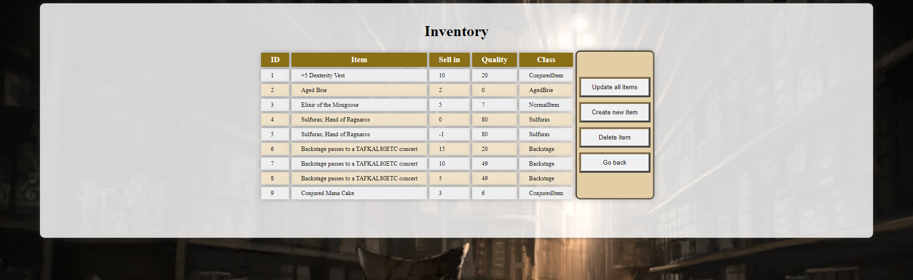
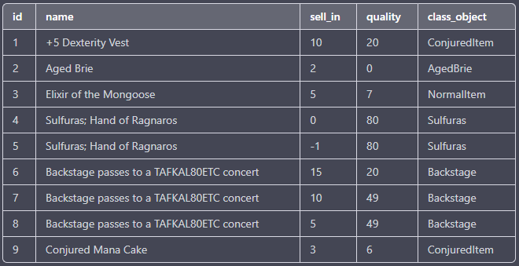
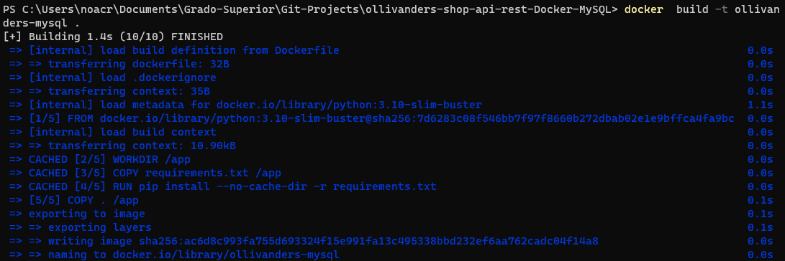
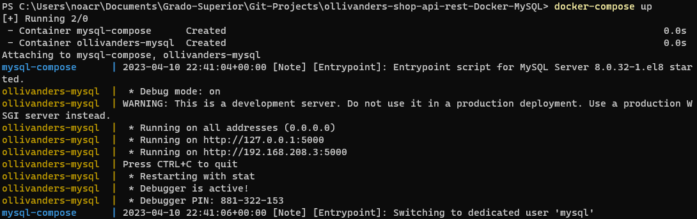
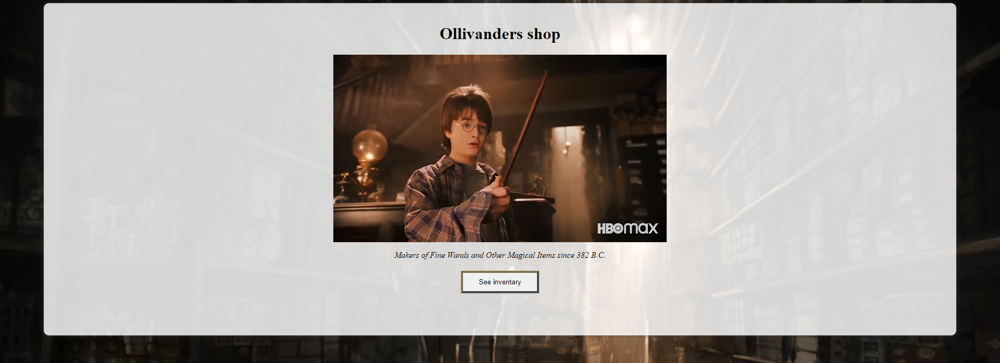
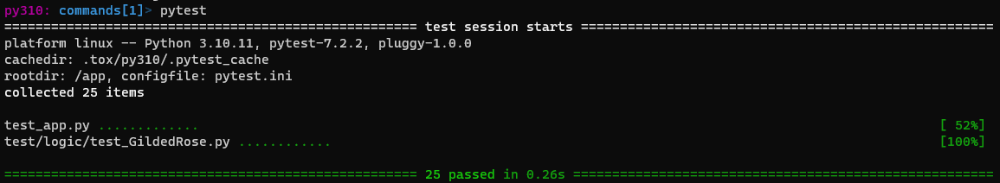
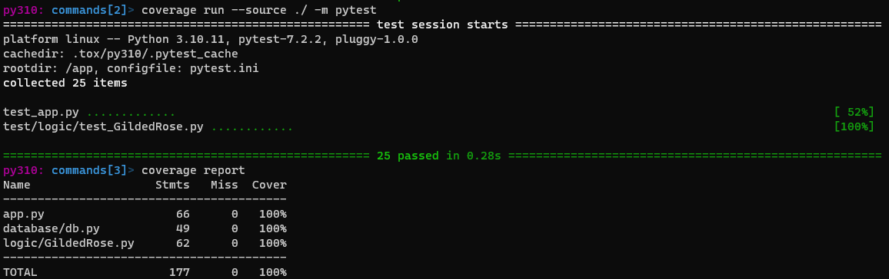
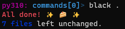
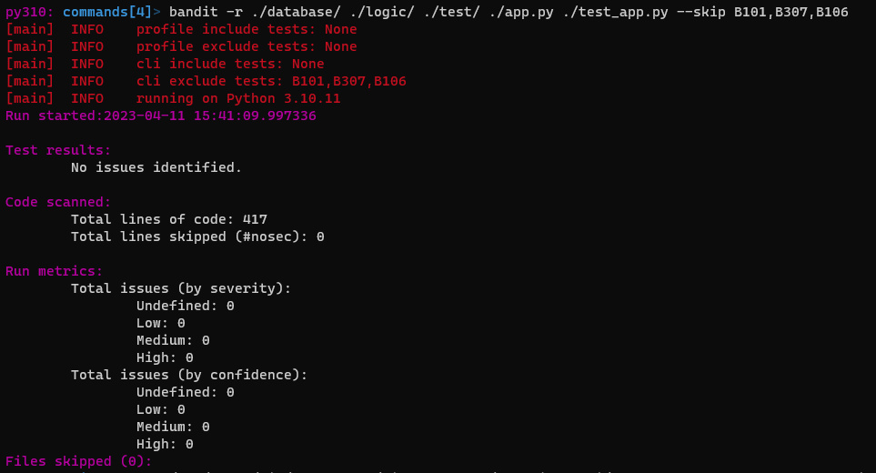
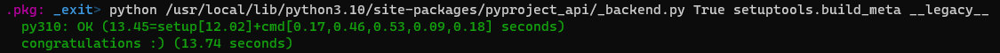

# Ollivanders Shop — REST API

**Table of contents**

- [Ollivanders Shop — REST API](#ollivanders-shop--rest-api)
  - [Introduction](#introduction)
    - [Database schema](#database-schema)
  - [How to install and use using Docker](#how-to-install-and-use-using-docker)
  - [Testing and development](#testing-and-development)
    - [Requirements for developers](#requirements-for-developers)
    - [Pytest](#pytest)
    - [Coverage](#coverage)
    - [Black](#black)
    - [Bandit](#bandit)
    - [Tox](#tox)

## Introduction

**IMPORTANT:** This is a MySQL version in Docker of Ollivanders Shop. For a SQLite version in your local host or Docker, go to [its respective repository](https://github.com/ncocana/ollivanders-shop-api-rest). All required instructions to install and execute it, will be there.

Ollivanders Shop is a [REST API](https://en.wikipedia.org/wiki/Representational_state_transfer) that allows you to make [CRUD](https://en.wikipedia.org/wiki/Create,_read,_update_and_delete) operations (such as get, update, create, or delete data from a database) using the website created for it. This website will allow you to see the content of the database and choose if you want to update it, insert new data, or delete an already existing one, by just hitting a button (and if neccessary, write the data asked to do such operations).   



I will leave the [link to the project](https://github.com/dfleta/flask-rest-ci-boilerplate) statement to those curious about the instructions we were given.   

### Database schema

The database has one table with five fields: ```id```, ```name```, ```sell_in```, ```quality```, and ```class_object```.   

```id``` refers to the ID of the item, and it will assigned automatically to each new item.   
```name``` refers to the name of the item.   
```sell_in``` refers to the number of days until the item is sold.   
```quality``` refers to the quality of the object, which increases or decreases (depending on its class) as the days pass.   
```class_object``` refers to the type of the item, which will determine how the item's quality changes.   

Here is a sample of what the database's table will look like:   



## How to install and use using Docker

Before proceeding, you will need to have installed: ```Git``` and ```Docker```.

Let's start the tutorial:

1. First, create a directory/folder in which you will store the application. If you doing this with the terminal, you will need to use this commands:

    ```
    mkdir .\ollivanders
    cd ollivanders
    ```

2. Clone the repository inside that directory.

    ```
    git clone https://github.com/ncocana/ollivanders-shop-api-rest-Docker-MySQL.git
    ```

3. Build the Docker image by running the following command. This will create a Docker image with the tag "ollivanders-rest-api".

    ```
    docker build -t ollivanders-mysql .
    ```

    

    You can view the image created with the command: ```docker images```.   

    To remove the image, get its ID or name with the command from above and do this command: ```docker rmi [image's ID or name]```. Using the image of above as example, the command would be: ```docker rmi ac6d8c993fa7```.

4. Now, run the Docker compose file using the following command:

    ```
    docker-compose up
    ```

    This will create the needed container (one for the MySQL database, and another for the web application using the image you built before) and a network for the containers to connect with each other.

    
   
    To access the Flask application in your web browser all you need to do is go to [http://localhost:5000](http://localhost:5000) or [http://127.0.0.1:5000/](http://127.0.0.1:5000/).

    To cancel to stop the containers, pulse ```Ctrl + C```. Then you can delete the containers and its network with:   

    ```
    docker-compose down
    ```

    Additionally, if you don't want to see the container's logs, you can run the Docker compose file in the background of the terminal with: ```docker-compose up -d```. The proccess to delete the containers and its network is the same as above.

    You can view the container created with the command: ```docker ps -a``` (this will show you all the containers, running or not. To view only the ones running at the moment: ```docker ps```).   

    You can enter the container with: ```docker exec -it ollivanders-mysql bash```.   

5. Now you should be seeing the website! Its interface is simple and intuive enough to know what to do without more guidance. You just need to click on the button of your choice to perform the CRUD operations you want. And remember, swish and flick!   

       

## Testing and development

### Requirements for developers

For executing the tests and others packages of similar nature, you will need to enter to the Ollivander's container (```docker exec -it ollivanders-mysql bash```) and install inside the requirements for developers mentioned previously:

```
pip install -r dev-requirements.txt
```

### Pytest

Pytest is a testing framework for Python. It allows developers to write unit tests and functional tests for their Python code in a simple and easy-to-use manner. Pytest provides many useful features such as fixtures, parametrization, and assertions.   

To execute it, write on the terminal:   

```
pytest
```



### Coverage

Coverage is a tool for measuring the amount of code that is executed during automated tests. It provides a way to determine which parts of a codebase are being tested and which are not, which can help developers identify gaps in their test coverage and improve the overall quality of their code.   

As you can see, through multiple tests, I managed to achieve a coverage of 100%, making sure that all the code is being tested and it works as it should. There's a few files that are excluded from coverage through the ```.coveragerc``` file, such as tests, the ```setup.py``` file, and some try/except statements.   

To execute Coverage, write on the terminal:   

```
coverage run --source ./ -m pytest
coverage report
```



### Black

Black is a code formatter for Python that reformats your code according to a set of predefined rules. It takes as input a Python code file and outputs a version of that file with consistent formatting, such as indentation, line length, and whitespace. Black is designed to be highly opinionated and strives to produce code that is consistent, readable, and easy to maintain.   

To execute Black, write on the terminal:   

```
black .
```



### Bandit

Bandit is a security linter tool for Python that analyzes your code for potential security vulnerabilities. It checks for common security issues, such as SQL injection, cross-site scripting (XSS), and command injection, among others. Bandit uses static analysis techniques to scan your code and identify potential security problems, making it a valuable tool for ensuring that your code is secure and safe to run.   

In my case, I have told bandit to analyze the folders and files concerning my project, leaving out those pertaining to configuration and other packages. I have also told it to skip the tests B101, B307, and B106. B101, B307, and B106 are security issues identifiers in Bandit that refers to the detection of certain vulnerabilities in my code.   

[B101](https://bandit.readthedocs.io/en/latest/plugins/b101_assert_used.html) detects the use of "assert" statements and flags them as a potential security issue, as an attacker may be able to disable or bypass the "assert" statement and exploit the underlying vulnerability. As I use asserts in my tests, I decided to exclude B101 from the analisys.   

[B307](https://bandit.readthedocs.io/en/latest/blacklists/blacklist_calls.html#b307-eval) detects the use of ```eval()``` as a possibly insecure function. I tried to find alternatives to ```eval()```, but either they didn't work, or were too complicated to even try. So unfortunately, I ended up giving up and decided to exclude B307 from the analisys for the time being.   

[B106](https://bandit.readthedocs.io/en/1.7.5/plugins/b106_hardcoded_password_funcarg.html) identifies function calls that are passed a string literal keyword argument and checks if the assigned local variable appears to be a password. In my case, it raises this issue due to the blunt use of a not-secured password. I'm aware this is a bad practice, and in another circunstances, I would have used something like an .env file to secure such data. But as this is intended to be a project to connect two Docker containers, I chose not to for the sake of the project's simplicity.   

To execute Bandit, write on the terminal:   

```
bandit -r ./database/ ./logic/ ./test/ ./app.py ./test_app.py --skip B101,B307,B106
```



### Tox

Tox is a tool for automating the testing and building of Python packages across multiple environments. It allows you to define a set of virtual environments, each with its own Python version and dependencies, and then run a series of tests or commands against each of these environments.   

All the images that you have seen until now in this section are outputs from Tox.   

To execute Tox, write on the terminal:   

```
tox
```


